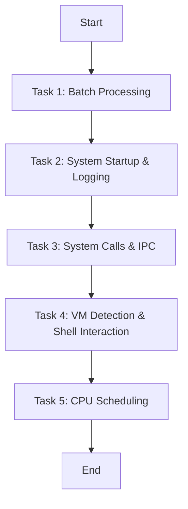

# OS Lab Assignment 4

🧠 ENCS351 – Operating Systems Lab (Sheet 4 Report)

**Name: Akash Singh Sagar**
**Roll No.: 2301420056**
**Program: B.Tech (CSE/DS)**
**Date Submitted: 10-11-2025**

Task 1: Batch Processing

Approach:
Implemented sequential batch execution using Python’s subprocess module to automate running multiple scripts in order, simulating traditional batch job processing.

Evidence:
📸 screenshots/task1.png
📄 Output: outputs/task1_batch_output.txt

Task 2: System Startup & Logging

Approach:
Used Python’s multiprocessing library to simulate system startup processes, with structured logging to capture the process lifecycle and events into a log file.

Evidence:
📸 screenshots/task2.png
📄 Log File: outputs/system_log.txt

Task 3: System Calls & Inter-Process Communication (IPC)

Approach:
Developed a C program demonstrating core UNIX system calls:

fork() for process creation

exec() for program replacement

wait() for synchronization

pipe() for IPC

Also implemented a Python version using os.pipe() and os.fork() for comparative analysis.

Evidence:
📸 screenshots/task3_exec.png, screenshots/task3_pipe.png
📄 Outputs: outputs/task3_exec.txt, outputs/task3_pipe.txt

Task 4: VM Detection & Shell Interaction

Approach:
Created:

sysinfo.sh: Displays system, kernel, and virtualization info.

vm_detect.py: Combines multiple heuristics — systemd-detect-virt, CPU hypervisor flags, and DMI identifiers — to detect virtualization environments.

Evidence:
📸 screenshots/task4.png
📄 Outputs: outputs/task4_sysinfo.txt, outputs/task4_vmdetect.txt

Task 5: CPU Scheduling Algorithms (FCFS, SJF, RR, Priority)

Approach:
Implemented classical CPU scheduling algorithms:

FCFS (First Come First Serve)

SJF (Shortest Job First)

Priority Scheduling

Round Robin (RR) with configurable time quantum

Each algorithm calculates Waiting Time (WT), Turnaround Time (TAT), and their averages for comparative analysis.

Evidence:
📸 screenshots/task5_fcfs.png, screenshots/task5_sjf.png,
screenshots/task5_rr.png, screenshots/task5_priority.png
📄 Outputs: outputs/task5_*.txt

Observations & Learnings

Batch Processing: Demonstrated job queue automation and sequential execution.

System Logging: Illustrated process tracking and event recording — essential in system startup/shutdown.

System Calls & IPC: Showed process isolation via fork/exec and communication via pipes.

VM Detection: Highlighted how OS-level heuristics reveal virtualization environments.

CPU Scheduling: Showed trade-offs between throughput and responsiveness —

SJF: Minimizes average waiting time when burst times are known.

RR: Enhances interactivity and fairness in time-sharing systems.

References

Tanenbaum, A. S. Modern Operating Systems

GeeksforGeeks: Operating System Concepts

